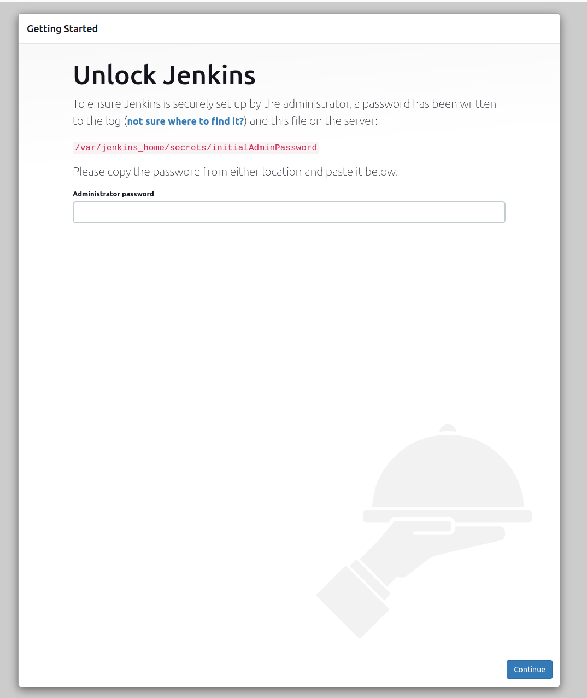

== Zadanie 1. Instalacja i uruchomienie Jenkinsa bezpośrednio w systemie Linux

Kroki:

. Zainstaluj Jenkinsa zgodnie z link:install-linux.adoc[instrukcją]
. Wejdź na adres: http://localhost:8080/
. Powinieneś otrzymać taką stronę 
. Znajdź hasło administratora komendą `sudo cat /var/lib/jenkins/secrets/initialAdminPassword`
. Wykonaj wstępną konfigurację Jenkinsa zgodnie z link:first-configuration.adoc[instrukcją]

== Zadanie 2. Uruchomienie Jenkinsa za pomocą Dockera bez DinD

Kroki:

. Uruchom Jenkinsa zgodnie z link:install-docker-without-dind.adoc[instrukcją]
. Wejdź na adres: http://localhost:8081/
. Powinieneś otrzymać taką stronę 
. Znajdź hasło administratora komendą `sudo docker exec jenkins-without-dind cat /var/jenkins_home/secrets/initialAdminPassword`
. Wykonaj wstępną konfigurację Jenkinsa zgodnie z link:first-configuration.adoc[instrukcją]

== Zadanie 3. Uruchomienie Jenkinsa za pomocą Dockera z DinD

Kroki:

. Uruchom Jenkinsa zgodnie z link:install-docker-with-dind.adoc[instrukcją]
. Wejdź na adres: http://localhost:8082/
. Powinieneś otrzymać taką stronę 
. Znajdź hasło administratora komendą `sudo docker exec jenkins-with-dind cat /var/jenkins_home/secrets/initialAdminPassword`
. Wykonaj wstępną konfigurację Jenkinsa zgodnie z link:first-configuration.adoc[instrukcją]

== Zadanie 4. Instalacja i konfiguracja pluginów

Kroki:

. Zainstaluj pluginy:
* Git
* Eclipse Temurin installer
* Pipeline
* Workspace Cleanup
. Skonfiguruj narzędzia
* Dodaj instaler JDK w wersji `jdk-17.0.7+7` i nazwij go `jdk-17`
* Dodaj instaler Mavena w wersji `3.9.2` i nazwij go `maven-3`

sudo usermod -aG docker jenkins
restart

== Instalacja 3 workerów

== Konfiguracja workerów
